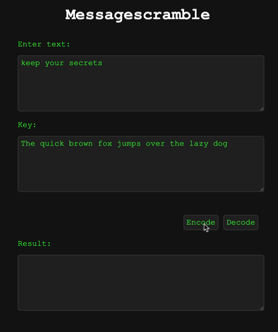

# Messagescramble

A seemingly simple, yet powerful way to encrypt messages. You set a message and a key. The key is a sentence that defines the order of the letters. The encrypted message then uses this order to replace the original letters with numbers.

## Usage 

You have two methods to use, encode and decode. The getkeys method is a helper used by the others. 

* `encode(message,key)` - encodes the message and returns the scrambled one. The return format is a JSON object with `message` as the encoded message and and `missing` as an array. This one gets populated when your original message contains characters that the key does not provide. 
* `decode(message,key)` - decodes and encrypted message and returns a JSON object with the decoded message as `message`.

You can [use the demo page](https://codepo8.github.io/messagescramble/) to see the encryption and decryption process.
